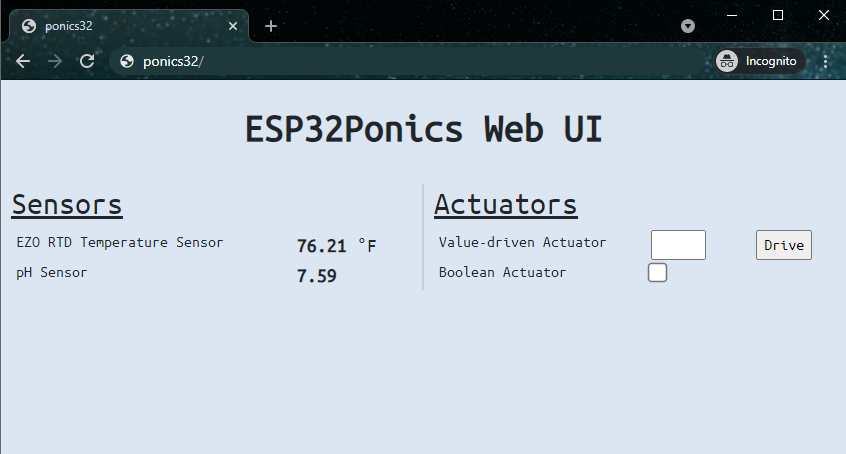

ponics32
====================

ponics32 is a hydro/aero/aquaponics monitoring & control system built using the ESP-IDF framework.



## Configuration
ponics32 is a FreeRTOS application that consists of sensor monitoring, actuator control, emergency detection, and an HTTP web server. HTML code for the UI is auto-generated at runtime from predefined arrays (`allSensors`, `allActuators`, `allEmergencies`) so users can focus on writing drivers.

Additional settings such as WiFi credentials can be found in `main/settings.h`.

ponics32 systems are characterized by 3 user-defined groups:
- Sensors
- Actuators
- Emergencies

### Sensors
Sensors are used to gather data from your \*ponics setup. Examples include temperature sensors, water level sensors, float switches, etc.

User-defined sensors must implement the `ISensor` interface defined in `components/sensor/include/ISensor.h`. 

All sensors are initialized and added to the `allSensors` array in the global `sensorsInit()` function defined in `components/sensor/src/sensors.cpp`. HTML code is generated from this array.


### Actuators
Actuators are used to control outputs from your \*ponics setup. Examples include water pumps, LED strips, heating elements, etc.

User-defined actuators must implement the `IActuator` interface defined in `components/actuator/include/IActuator.h`. 

All actuators are initialized and added to the `allActuators` array in the global `actuatorsInit()` function defined in `components/actuator/src/actuators.cpp`. HTML code is generated from this array.


### Emergencies
Emergencies are used to trigger a callback when a certain condition is met. Examples include shutting off a water pump if high water level, turning on a heater if low temperature, etc.

User-defined emergencies must implement the `IEmergency` interface defined in `components/emergency/include/IEmergency.h`. 

All emergencies are initialized and added to the `allEmergencies` array in the global `emergenciesInit()` function defined in `components/emergency/src/emergencies.cpp`.


## Building/Flashing
ponics32 can be built and flashed using Espressif's `idf.py`:

```
cd ponics32/
idf.py -p <PORT> flash
```


